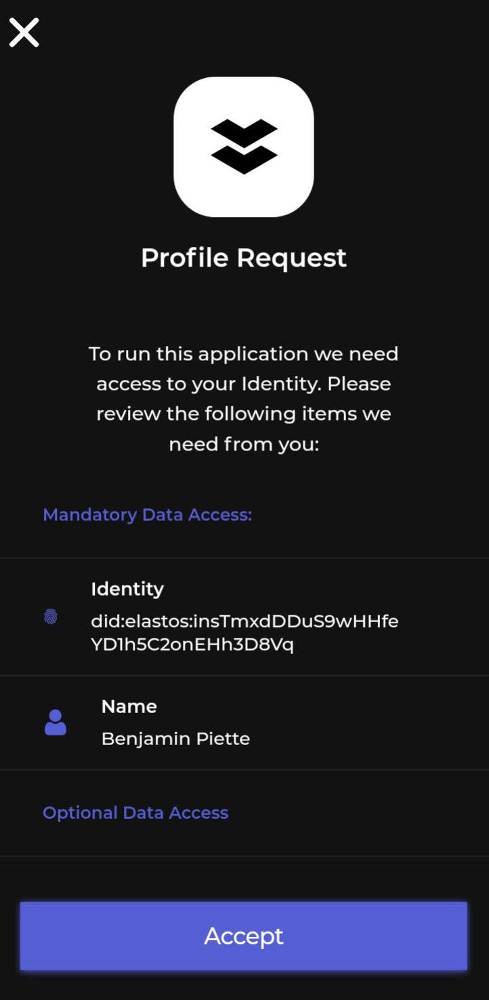

# Decentralized Identity

## DID Verifiable Credentials

**Verifiable Credentials** are blocks of data related to a specific DID. They usually store users' names, emails, phone numbers, and other important types of application-specific information. Applications can generate these credentials, ask users to import them to their DID profile (privately or publicly), and verify them (make sure who issued a credential). For more information, please refer to the "**TODO - DID documentation."**

## Instantiate the DID Access Helper

The DID Access Helper makes it easy to execute remote operations in the wallet in just a few lines of code. All of the below examples use an instance of this helper tool that are created as follows:



```typescript
// Connectivity SDK classes
import { connectivity, DID as ConnDID } from "@elastosfoundation/elastos-connectivity-sdk-js";

// DID SDK classes, used to manipulate inputs/outputs to the connectivity SDK
import { DID, DIDBackend, DIDStore, Issuer, Mnemonic, RootIdentity, VerifiableCredential } from "@elastosfoundation/did-js-sdk";

let didAccess = new ConnDID.DIDAccess();
```



## Get user's DID data / credentials

In order for a third party application to get a user's "DID string" (DID identifier) or email, it can request the identity wallet to "get some credentials". Here's how it works:



```typescript
// Request credentials from the wallet
let presentation = await didAccess.getCredentials({
  claims: {
    name: true, // Mandatory
    avatar: {
      required: false, // Optional
      reason: "Show who you are to others"
    }
  }
);

// The returned information is a Verifiable Presentation that contains
// one or more credentials. The DID SDK can then be used to manipulate 
// those credentials.
let nameCredential = presentation.getCredentials().find((c) => {
  // Find the "name" credential
  return c.getId().getFragment() === "name";
});
console.log("Thank you for joining " + nameCredential.getSubject().getProperty("name"));
}
```




**Tip: **If you want to get a user's DID string (did:elastos:abc) only, pass an empty list of claims.


Here's an example of a user prompt generated inside the Elastos Essentials identity wallet (using the **Elastos Essentials Connector**), after a call to didAccess.getCredentials(). On the client side, the call to didAccess.getCredentials() receives a response only after the user accepts or rejects this request:



## Import Credentials to a User's DID

The main idea behind DIDs is for various actors to generate credentials to and read credentials from users. As seen above, receiving credentials from users can be considered as a "read" operation. The below code now describes how to "write" data.&#x20;

In a decentralized world, applications never write DID data (credentials) directly somewhere. Instead, they **generate credentials** and **ask users to import credentials to their identity profile**. Users can choose to make such credentials visible from all (by publishing them on the blockchain) or to keep them private (stored only on their device).&#x20;

The first step before asking a user to import a credential is to create the credential itself. More details on creating credentials are provided in the** "TODO - DID SDK DOCUMENTATION". **For our Connectivity SDK guide, we utilize the simplest possible way to do so.



```typescript
// For this guide, always re-create a new identity for the signer of the created credential.
// In real life, the signer should remain the same.
DIDBackend.initialize(new ConnDID.ElastosIODIDAdapter(ConnDID.ElastosIODIDAdapterMode.MAINNET));
let didStore = await DIDStore.open("any-did-store-name");
let rootIdentity = RootIdentity.createFromMnemonic(Mnemonic.getInstance().generate(), "", didStore, "unsafepass", true);

// The issuer is the entity who creates the credential. Usually, the current application.
let issuerDID = await rootIdentity.newDid("unsafepass", 0, true); // Index 0, overwrite
let issuer = new Issuer(issuerDID);

// The target DID is the user. We want to issue a credential, for him. 
// Such DID string should first be obtained from 
// a call to didAccess.getCredentials()
let targetDID = DID.from("did:elastos:abcdef");

// Create the credential and sign it with the app identity.
let vcb = new VerifiableCredential.Builder(issuer, targetDID);
let credential = await vcb.id("#diploma").properties({
  year: "2009",
  speciality: "Marketing"
}).type("DiplomaCredential").seal("unsafepass");
```




**NOTE**: In production applications, creating the credential should happen on the **server side** as this requires access to the issuer's DID private key which cannot be deployed on the client side. Then, the generated credentials are usually transmitted to the application's client side (ex: a web browser) where the connectivity SDK can be called.


We can now ask the Connectivity SDK to **send this credential** to the connected user, so they can add it to their identity profile:



```typescript
// Send the credential to the identity wallet (essentials)
let didAccess = new ConnDID.DIDAccess();
let options: ConnDID.ImportCredentialOptions = {
  // If true, the identity wallet may force user to publish 
  // his recent changes on the blockchain. Useful in case the
  // application needs the credential to be usable publicly and
  // not only remain on user's device.
  forceToPublishCredentials: true
};

let importedCredentials = await didAccess.importCredentials([credential], options);
```



## Delete Credentials from User's DID

## Issue a credential for another DID

Third party applications can prepare credential information on their side and request the user to sign and return a credential from the identity application. For instance, for convenience, a medical web app can prepare data for a doctor to create a drug prescription credential, and the doctor only needs to check the content then sign this, from his identity app, without manually doing any other operation.



```typescript
let issuedCredential = await didAccess.issueCredential(
  "did:elastos:iqeXQuCuUuZ2mdHuPUhQpQGFs4HqHixm3G", // For who?
  ["PrescriptionCredential"], // Credential type, to match a standard format
  // Real content
  {
    "drug1": {
      "quantity": 1234,
      "frequency": "Twice per day"
    }
  },
  "testissue" // Credential name
);
```



## Delete credentials from user's DID

When applications consider a credential currently in a user's profile as obsolete, they can request to delete it. As usual with decentralized identities, applications have no way to directly delete credentials by themselves - instead, they need to ask the identity wallet and user to do this.



```typescript
// Ask user to delete the email. He can confirm or reject 
// this request
let deletedCredentials = await didAccess.deleteCredentials([
    "#email30" // Credential ID
]);
```



## Request to Publish User's DID

Applications can request for the identity wallet to publish the user's latest public DID profile (their "DID Document") at the current moment. Normally, this doesn't need to be done manually by applications, but here is how to trigger this request:



```typescript
// If user agrees with this request, the transaction ID for the on
// going publication is returned and can be check on the identity
// chain explorer.
let txId = await didAccess.requestPublish();
```



## Sign Any Data with User's DID

Any arbitrary string can be signed by a user's DID. The returned value contains the signing DID string, its public key, the generated signature, and a JWT token containing the whole response.&#x20;

The JWT can be used to verify that the returned information is genuine.



```typescript
let signedData = await didAccess.signData("data-to-sign", { extraField: 123 }, "customSignatureField");
```




**Advanced**: if you plan to use the JWT token as-is, you can specify additional custom fields to add in that JWT, and the signature field name.

