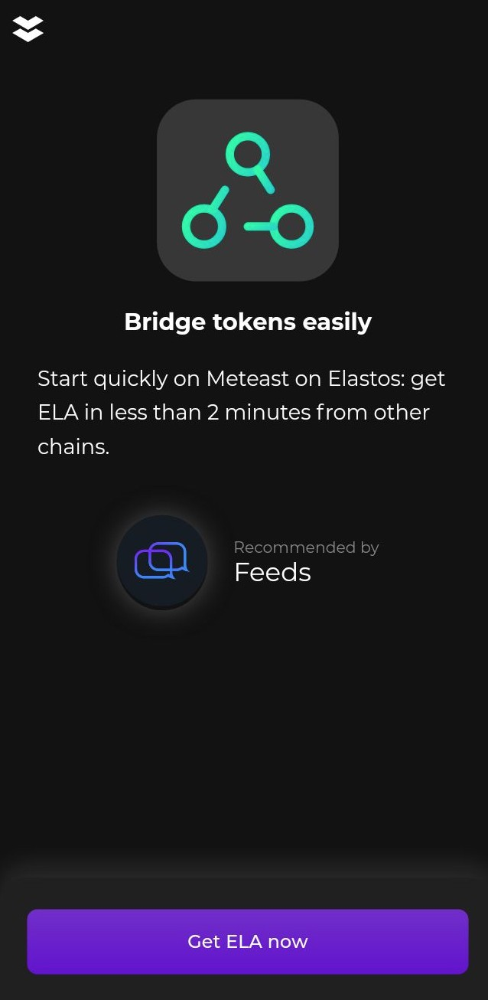

# User experience

In order to facilitate the overall user flow between dApps and identity wallets, the connectivity SDK provide a "UX" section. Currently, only one method is defined.

## On boarding

Wallets can assist dApps to welcome users to discover new features easily. This is a convenient way to directly reach specific features in wallets, rather than writing guides to tell users to touch here or there. This also brings a customised experience to make users comfortable by seeing the application logo and a custom introduction of the feature.



```typescript
import { connectivity, UX } from "@elastosfoundation/elastos-connectivity-sdk-js";

public async callEasyBridge() {
    connectivity.setApplicationDID("your app DID with configured icon and name");

    let ux = new UX.UXAccess();
    await ux.onBoard("easybridge", "Bridge tokens easily", "Start quickly on Elastos: get ELA in less than 2 minutes from other chains.", "Get ELA now");
}
```



### List of supported feature names

|                |                                                                                                                                                                                |
| -------------- | ------------------------------------------------------------------------------------------------------------------------------------------------------------------------------ |
| **easybridge** | If available, the wallet provides a feature to easily bridge and swap tokens. Usually used to quickly acquire tokens needed by the currently used dApp (eg: a NFT marketplace) |


